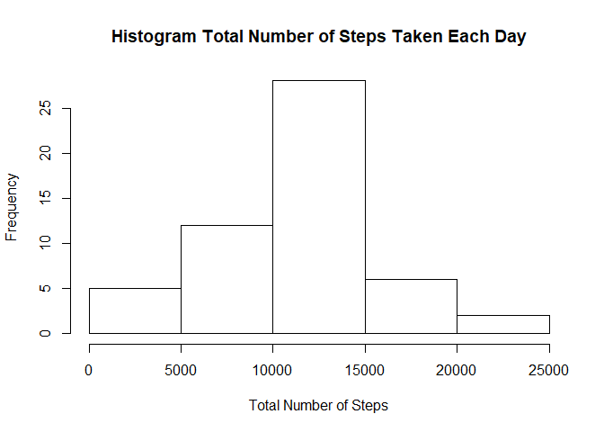
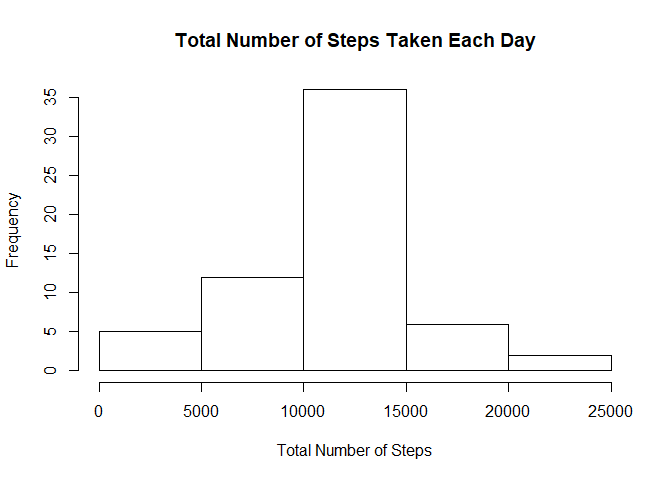

## Loading and preprocessing the data

#### Load the data (i.e. \color{red}{\verb|read.csv()|}read.csv())


```r
file <- paste(getwd(), "/activity/activity.csv", sep = "")
```

#### Process/transform the data (if necessary) into a format suitable for your analysis


```r
dataOrig <- read.csv(file, header = TRUE)
data <- dataOrig[complete.cases(dataOrig), ]
```

## What is mean total number of steps taken per day?

#### Calculate the total number of steps taken per day


```r
sumsteps <- tapply(data$steps, data$date, sum)
sumsteps <- sumsteps[complete.cases(sumsteps)]
```

#### If you do not understand the difference between a histogram and a barplot, research the difference between them. Make a histogram of the total number of steps taken each day


```r
hist(sumsteps, xlab = "Total Number of Steps", main = "Histogram Total Number of Steps Taken Each Day")
```

<!-- -->

#### Calculate and report the mean and median of the total number of steps taken per day


```r
stats <- as.data.frame(c(mean(sumsteps), median(sumsteps)))
rownames(stats) <- c("Mean", "Median")
colnames(stats) <- "Summary"
stats
```

```
##         Summary
## Mean   10766.19
## Median 10765.00
```

## What is the average daily activity pattern?

#### Make a time series plot (i.e. \color{red}{\verb|type = "l"|}type="l") of the 5-minute interval (x-axis) and the average number of steps taken, averaged across all days (y-axis)


```r
meansteps <- tapply(data$steps, data$interval, mean)
meansteps <- cbind(meansteps, rownames(meansteps))
colnames(meansteps) <- c("Average", "Interval")
plot(meansteps[, 2], meansteps[, 1], type = "l", xlab = "Five Minute Interval", ylab = "Average Number of Steps", main = "Average Number of Steps Taken, Averaged Across All Days")
```

<!-- -->

#### Which 5-minute interval, on average across all the days in the dataset, contains the maximum number of steps?


```r
max(meansteps)
```

```
## [1] "99.4528301886792"
```

```r
meansteps[which(meansteps[, 1] == max(meansteps)), ][2]
```

```
## Interval 
##   "1845"
```

## Imputing missing values

#### Note that there are a number of days/intervals where there are missing values (coded as \color{red}{\verb|NA|}NA). The presence of missing days may introduce bias into some calculations or summaries of the data.

#### Calculate and report the total number of missing values in the dataset (i.e. the total number of rows with \color{red}{\verb|NA|}NAs)


```r
numNA <- sum(!complete.cases(dataOrig))
paste("Total Number of Missing Values in the Dataset:", numNA)
```

```
## [1] "Total Number of Missing Values in the Dataset: 2304"
```

#### Devise a strategy for filling in all of the missing values in the dataset. The strategy does not need to be sophisticated. For example, you could use the mean/median for that day, or the mean for that 5-minute interval, etc.

##### I am using the mean for the 5-minute interval.


```r
dataNew <- dataOrig
for(i in 1:length(dataOrig$steps)) {
  if(is.na(dataOrig$steps[i]) == TRUE) {
    dataNew$steps[i] <- meansteps[which(meansteps[, 2] == dataNew$interval[i]), 1]
  }
}
```

#### Make a histogram of the total number of steps taken each day and Calculate and report the mean and median total number of steps taken per day. Do these values differ from the estimates from the first part of the assignment? What is the impact of imputing missing data on the estimates of the total daily number of steps?


```r
sumsteps2 <- tapply(as.numeric(dataNew$steps), dataNew$date, sum)
hist(sumsteps2, xlab = "Total Number of Steps", main = "Total Number of Steps Taken Each Day")
```

<!-- -->

```r
stats2 <- as.data.frame(c(mean(sumsteps2), median(sumsteps2)))
rownames(stats2) <- c("Mean", "Median")
colnames(stats2) <- "Summary"
stats2
```

```
##         Summary
## Mean   10766.19
## Median 10766.19
```

##### The mean value is the same as the mean estimate from the first part of the assignment, but the median value increases slightly from the median estimate from the first part.

##### Imputing missing data on the estimates of the total daily number of steps yields the same mean values as the "incomplete" original dataset, but there can be a slight change in the mean values.

## Are there differences in activity patterns between weekdays and weekends?

#### Create a new factor variable in the dataset with two levels – “weekday” and “weekend” indicating whether a given date is a weekday or weekend day.


```r
dataNew$day_type <- weekdays(as.Date(dataNew$date))
dataNew$day_type[which(dataNew$day_type  == "Saturday" | dataNew$day_type  == "Sunday")] <- "Weekend"
dataNew$day_type[which(dataNew$day_type  != "Weekend")] <- "Weekday"
dataNew$day_type <- as.factor(dataNew$day_type)
```

#### Make a panel plot containing a time series plot (i.e. \color{red}{\verb|type = "l"|}type="l") of the 5-minute interval (x-axis) and the average number of steps taken, averaged across all weekday days or weekend days (y-axis). See the README file in the GitHub repository to see an example of what this plot should look like using simulated data.


```r
meansteps2 <- aggregate(as.numeric(steps) ~ interval + day_type, FUN = mean, data = dataNew)
colnames(meansteps2) <- c("Interval", "DayType", "Mean")
as.factor(colnames(meansteps2))
```

```
## [1] Interval DayType  Mean    
## Levels: DayType Interval Mean
```

```r
library(ggplot2)
```

```
## Warning: package 'ggplot2' was built under R version 3.6.1
```

```r
ggplot(meansteps2, aes(x = Interval, y = Mean)) + geom_line() + facet_grid(DayType~.) + labs(title = "Average Number of Steps: Weekday vs Weekend") + theme(plot.title = element_text(hjust = 0.5)) + xlab("Interval") + ylab("Average Number of Steps")
```

<!-- -->
